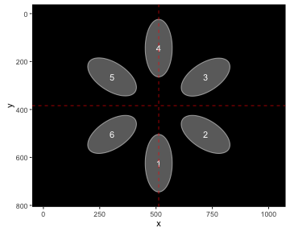
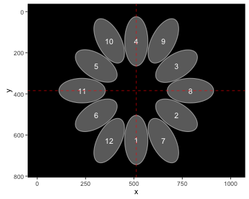
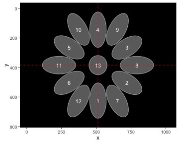
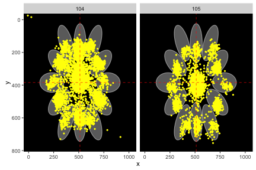
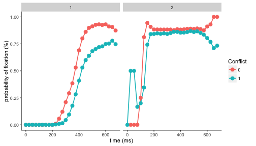
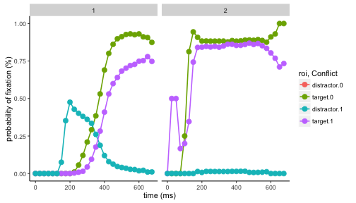
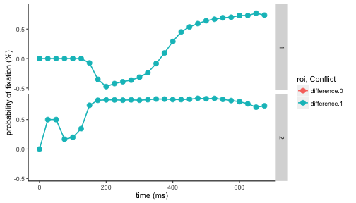

This will acquaint you with some of the basics of itrackR. There are a number of function for doing high-level analyses of eyetracking data. 


##Example Data

Some sample data is included with itrackR. This includes 2 EDF files from an SR-Research Eyetracker, and a behavioral file (saved as a .rds). You can load them using `itrackR.data`:


```r
library(itrackR)
datapath <- itrackR.data('path')
edfs <- itrackR.data('edfs')
beh <- itrackR.data('beh')
```

`datapath` will point to the data folder wherever itrackR is installed:


```r
datapath
```

```
## [1] "/Library/Frameworks/R.framework/Versions/3.2/Resources/library/itrackR/data/"
```
`edfs` is a list of the 2 edfs found in that folder: 


```r
edfs
```

```
## [1] "/Library/Frameworks/R.framework/Versions/3.2/Resources/library/itrackR/data//104_exp.edf"
## [2] "/Library/Frameworks/R.framework/Versions/3.2/Resources/library/itrackR/data//105_exp.edf"
```

`beh` is a data frame of the behavioral data for the same 2 subjects. 


|  ID| Block| Trial| Task| Conflict| Targetpos| Distractorpos|
|---:|-----:|-----:|----:|--------:|---------:|-------------:|
| 104|     1|     1|    1|        1|         2|            11|
| 104|     1|     2|    1|        0|         4|            NA|
| 104|     1|     3|    1|        0|         2|            NA|
| 104|     1|     4|    1|        0|         6|            NA|
| 104|     1|     5|    1|        0|         4|            NA|
| 104|     1|     6|    1|        0|         2|            NA|
| 104|     1|     7|    1|        1|         3|             8|
| 104|     1|     8|    1|        1|         6|             9|
| 104|     1|     9|    1|        1|         6|             9|
| 104|     1|    10|    1|        1|         3|             7|

## Loading Data

We start by initializing the itrackR object and loading the data. This can be done in a couple different ways. If we have a list of all edf files (in the current working directory, or with full path names) we can do it like this.


```r
z <- itrackr(edfs=edfs)
```

```
## Loading file /Library/Frameworks/R.framework/Versions/3.2/Resources/library/itrackR/data//104_exp.edf
## Loading Events (59201 events across 1325 trials)....
## Done with 104_exp
## 
## Loading file /Library/Frameworks/R.framework/Versions/3.2/Resources/library/itrackR/data//105_exp.edf
## Loading Events (61362 events across 1325 trials)....
## Done with 105_exp
## 
## 
## Done processing all files!
```

```r
#Alternatively, we can provide the path and a search pattern to find all edfs in a certain folder:
#z <- itrackr(path=datapath, pattern='*.edf')
```

## Object Structure

The `itrackR` object consists of fields for each relevant event. Each one is a data frame. The `ID` fields specifies each subject. The subject ID is formed from extracting only the numeric data from the EDF file. 

`z$fixations`

|   | eyetrial| sttime| entime|  gavx|  gavy|  ID| fixation_key|
|:--|--------:|------:|------:|-----:|-----:|---:|------------:|
|6  |        1| 220498| 220649| 493.9| 433.5| 104|            1|
|10 |        1| 220662| 223307| 528.0| 409.5| 104|            2|
|16 |        1| 223526| 223596| 520.4| 396.8| 104|            3|
|20 |        1| 223602| 224913| 527.8| 399.7| 104|            4|
|26 |        1| 225203| 229115| 525.2| 401.3| 104|            5|
|32 |        1| 229446| 230591| 534.7| 406.3| 104|            6|
|38 |        1| 231661| 231817| 500.1| 437.3| 104|            7|
|42 |        1| 231839| 232303| 529.6| 406.7| 104|            8|
|48 |        1| 233222| 233278| 527.7| 416.9| 104|            9|
|52 |        1| 233289| 234067| 532.1| 411.5| 104|           10|

`z$saccades`

|   | eyetrial| sttime| entime|  gstx|  gsty|  genx|  geny|  avel|   pvel|  ID| saccade_key|
|:--|--------:|------:|------:|-----:|-----:|-----:|-----:|-----:|------:|---:|-----------:|
|8  |        1| 220650| 220661| 497.2| 430.9| 512.7| 417.5|  50.7|   64.9| 104|           1|
|14 |        1| 223308| 223525| 532.9| 403.6| 522.5| 360.7| 295.0| 1024.5| 104|           2|
|18 |        1| 223597| 223601| 522.3| 404.2| 527.7| 400.7|  36.7|   39.0| 104|           3|
|24 |        1| 224914| 225202| 522.2| 391.9| 509.8| 375.7| 273.1| 1001.0| 104|           4|
|30 |        1| 229116| 229445| 523.4| 400.6| 520.7| 384.3| 236.9|  928.0| 104|           5|
|36 |        1| 230592| 231660| 536.3| 399.6| 574.7| 542.5| 242.9|  775.6| 104|           6|
|40 |        1| 231818| 231838| 496.9| 444.5| 514.9| 408.7|  57.6|   96.3| 104|           7|
|46 |        1| 232304| 233221| 534.1| 401.9| 507.9| 730.0| 264.4|  830.8| 104|           8|
|50 |        1| 233279| 233288| 528.1| 415.5| 521.0| 399.4|  52.0|   61.4| 104|           9|
|56 |        1| 234068| 234686| 535.1| 409.2| 543.4| 391.1| 202.2|  965.2| 104|          10|

`z$messages` shows the messages that were sent to Eyelink during the experiment

|    | eyetrial| sttime|message                    |  ID| message_key|
|:---|--------:|------:|:--------------------------|---:|-----------:|
|3   |        1| 220491|!MODE RECORD CR 1000 2 1 L | 104|           1|
|5   |        1| 220545|BASELINE_START BLOCK 1     | 104|           2|
|166 |        1| 280543|BASELINE_END BLOCK 1       | 104|           3|
|172 |        2| 306488|!MODE RECORD CR 1000 2 1 L | 104|           4|
|174 |        2| 306526|TRIALSTART                 | 104|           5|
|175 |        2| 306526|BLOCK 1                    | 104|           6|
|176 |        2| 306526|TRIAL 1                    | 104|           7|
|181 |        2| 307588|STIMONSET                  | 104|           8|
|198 |        2| 310200|RESPONSE                   | 104|           9|
|204 |        3| 310245|!MODE RECORD CR 1000 2 1 L | 104|          10|


## ROIs

Much of the analysis depends on specifying regions of interest (ROIs). We can then determine if fixations lie within these ROIs. First we specify all possible ROIs that may occur in an experiment. The function `radialCoords` makes it easy to specify a set of evenly-spaced coordinates arranged in a ring. We will create elliptical ROIs in this example. `roiFlower` makes it easy to rotate the ellipses to make a flower-like pattern. 


```r
#generate coordinates for our ROIs
innercoords <- radialCoords(x=512,y=384,numpoints=6,radius=240);
outercoords <- radialCoords(512, 384,6, 280,starting_angle=30); #larger radius, starting w/ 30 degree offset

#specify rotations of ellipses
angles <- roiFlower(12)
```

We use `makeROIs` to specify them. We can make elliptical or circular ROIs. First we make the inner ones. We can check our progress using `plot.rois`. Note the plots have the origin at the upper-left. This means that ROI #1 is actually at the 12 o'clock position if we viewed the plot in the regular orientation.


```r
#make elliptical ROIs and plot them
z <- makeROIs(z,innercoords,shape='ellipse',xradius=60, yradius=120, angles=angles[c(1,3,5,7,9,11)])
plot.rois(z)
```



Now we add the outer ROIs. We make sure and specify the `append` option, and also provide names. For now, names are limited to numbers. If you don't specify them, it will just use 1...n.


```r
#make elliptical ROIs and plot them
z <- makeROIs(z,outercoords,shape='ellipse',xradius=60, yradius=120, angles=angles[c(2,4,6,8,10,12)], names=7:12, append=T)
plot.rois(z)
```



Finally let's include a central, circular ROI. 


```r
#coordinates have to be a matrix:
centercoords <- matrix(c(512,384),nrow=1)

z <- makeROIs(z,centercoords,shapes='circle',radius=65, names=13, append=T)
plot.rois(z)
```



## Plotting

Once the ROIs are added, we can easily make scatterplots of fixations for each subject. This allows us to find calibration issues. 


```r
plot(z, zoom=TRUE)
```


## Merging with behavioral data

Ideally, we send a message to Eyelink on every trial in order to identify it in the EDF file. Every time the eyetracker is started and stopped, we call this a separate trial. In this example, every trial the message "BLOCK X" and "TRIAL X" was sent to eyelink. We can see the trial-wise information in the header of our object: 

`z$header`

```r
knitr::kable(head(z$header, 10))
```


| eyetrial| starttime| endtime| duration|  ID|
|--------:|---------:|-------:|--------:|---:|
|        1|    220491|  280546|    60055| 104|
|        2|    306488|  310209|     3721| 104|
|        3|    310245|  312492|     2247| 104|
|        4|    312531|  314339|     1808| 104|
|        5|    314376|  316290|     1914| 104|
|        6|    316324|  318635|     2311| 104|
|        7|    318675|  320693|     2018| 104|
|        8|    320724|  323834|     3110| 104|
|        9|    323864|  326202|     2338| 104|
|       10|    326228|  328290|     2062| 104|

Next we specify index variables that uniquely identify trials. This should be present in both the edf and behavioral file. `set_index` searches through the messages, finds the relevant ones, and extracts the numeric data. `set_index` can take a regular expression to find anything that matches this pattern, and `numeric.only` tells it to ignore any text (e.g., "BLOCK "). The variable names are stored in `z$indexvars` and the information is added to `z$header`.

`find_messages` is for pulling other message information from the EDF file. Here we want to have the timestamps of the stimulus onset and the response so we can refer to them later. 

`add_behdata` merges the behavioral file with the eye data, based on the index variables. This only works if we run `set_index` first (so we have `Block` and `Trial` variables in the behavioral data frame, and in our itrackR object).  


```r
#find messages to use as our index variables (to merge with our behavioral data)
z<- set_index(z,varnames=c('Block','Trial'), patterns=c('^BLOCK [0-9]*','^TRIAL [0-9]*'), numeric.only=T)

#find messages that specify the onset of events, extract the timestamps
z <- find_messages(z,varnames=c('STIMONSET','RESPONSE'), patterns=c('STIMONSET','RESPONSE'), timestamp=T)
#merge with behavioral data
z <- add_behdata(z,beh,append=F)
```

Now `z$beh` contains the behavioral data that matches with the eyetracking data, based on the index variables you specified (`Block` and `Trial`). It adds the variable `eyetrial`, which is also found in the `header`,`fixations`, `saccades`, `blinks`, and `messages` data frames in the itrackR object. It also adds the timestamps that you requested using `find_messages`:

|  ID| Block| Trial| Task| Conflict| Targetpos| Distractorpos| eyetrial| STIMONSET| RESPONSE|
|---:|-----:|-----:|----:|--------:|---------:|-------------:|--------:|---------:|--------:|
| 104|     1|     1|    1|        1|         2|            11|        2|      1100|     3712|
| 104|     1|    10|    1|        1|         3|             7|       11|      1077|     2153|
| 104|     1|    11|    1|        0|         2|            NA|       12|      1066|     1844|
| 104|     1|    12|    1|        1|         4|            11|       13|      1075|     2684|
| 104|     1|    13|    1|        1|         6|            12|       14|      1066|     2820|
| 104|     1|    14|    1|        1|         4|             9|       15|      1074|     2827|
| 104|     1|    15|    1|        1|         6|             8|       16|      1081|     2746|
| 104|     1|    16|    1|        1|         5|            11|       17|      1084|     2646|
| 104|     1|    17|    1|        0|         2|            NA|       18|      1071|     2137|
| 104|     1|    18|    1|        0|         4|            NA|       19|      1074|     2027|


We can also see that the header has been updated

`z$header`

```r
knitr::kable(head(z$header, 10))
```


| eyetrial| starttime| endtime| duration|  ID| Block| Trial| STIMONSET| RESPONSE|
|--------:|---------:|-------:|--------:|---:|-----:|-----:|---------:|--------:|
|        1|    220491|  280546|    60055| 104|    NA|    NA|        NA|       NA|
|        2|    306488|  310209|     3721| 104|     1|     1|    307588|   310200|
|        3|    310245|  312492|     2247| 104|     1|     2|    311315|   312488|
|        4|    312531|  314339|     1808| 104|     1|     3|    313600|   314336|
|        5|    314376|  316290|     1914| 104|     1|     4|    315456|   316288|
|        6|    316324|  318635|     2311| 104|     1|     5|    317393|   318632|
|        7|    318675|  320693|     2018| 104|     1|     6|    319745|   320687|
|        8|    320724|  323834|     3110| 104|     1|     7|    321789|   323831|
|        9|    323864|  326202|     2338| 104|     1|     8|    324928|   326199|
|       10|    326228|  328290|     2062| 104|     1|     9|    327292|   328287|


##Drift Correction

It looks like subject 104 is off-center, due to poor calibration. We can correct for this using `drift_correct`. We can optionally specify a grouping variable (from the behavioral data) so that correction is done separately for each level of that variable. In this case, let's perform correction for each subject and block. The threshold specifies the minimum amount of movement detected before we actually do any correction.


```r
z <- drift_correct(z,vars='Block',threshold=15) 
plot(z,zoom=T)
```




Much better!

##Determining Fixation/Saccade "Hits"

Next we code whether each fixation and saccade "hit" any of the ROIs using `calcHits`


```r
z <- calcHits(z)
```

Note that the `fixations` data frame now has binary vectors for each ROI specifying whether the fixation hit that item or not:


```r
knitr::kable(head(z$fixations, 10))
```


| fixation_key|  ID| eyetrial| sttime| entime|  gavx|  gavy| roi_1| roi_2| roi_3| roi_4| roi_5| roi_6| roi_7| roi_8| roi_9| roi_10| roi_11| roi_12| roi_13|
|------------:|---:|--------:|------:|------:|-----:|-----:|-----:|-----:|-----:|-----:|-----:|-----:|-----:|-----:|-----:|------:|------:|------:|------:|
|            1| 104|        1|     NA|     NA| 477.4| 433.5|     0|     0|     0|     0|     0|     0|     0|     0|     0|      0|      0|      0|      1|
|            2| 104|        1|     NA|     NA| 511.5| 409.5|     0|     0|     0|     0|     0|     0|     0|     0|     0|      0|      0|      0|      1|
|            3| 104|        1|     NA|     NA| 503.9| 396.8|     0|     0|     0|     0|     0|     0|     0|     0|     0|      0|      0|      0|      1|
|            4| 104|        1|     NA|     NA| 511.3| 399.7|     0|     0|     0|     0|     0|     0|     0|     0|     0|      0|      0|      0|      1|
|            5| 104|        1|     NA|     NA| 508.7| 401.3|     0|     0|     0|     0|     0|     0|     0|     0|     0|      0|      0|      0|      1|
|            6| 104|        1|     NA|     NA| 518.2| 406.3|     0|     0|     0|     0|     0|     0|     0|     0|     0|      0|      0|      0|      1|
|            7| 104|        1|     NA|     NA| 483.6| 437.3|     0|     0|     0|     0|     0|     0|     0|     0|     0|      0|      0|      0|      1|
|            8| 104|        1|     NA|     NA| 513.1| 406.7|     0|     0|     0|     0|     0|     0|     0|     0|     0|      0|      0|      0|      1|
|            9| 104|        1|     NA|     NA| 511.2| 416.9|     0|     0|     0|     0|     0|     0|     0|     0|     0|      0|      0|      0|      1|
|           10| 104|        1|     NA|     NA| 515.6| 411.5|     0|     0|     0|     0|     0|     0|     0|     0|     0|      0|      0|      0|      1|

This is not terribly useful if your task-relevant ROI changes positions on each trial. You can use `mapROIs` map your experiment-wide ROIs (1,2,3...13) to trial-specific ROIs ('target','distractor'). You just need a variable in your behavioral data that specifies the number of the relevant ROI. Here, `Targetpos` specifies the target location, and `Distractorpos` specifies the distractor location: 


```r
z <- mapROIs(z,names=c('target','distractor'),indicators=c('Targetpos','Distractorpos'))
```

Now we can see a `target_hit` and `distractor_hit` variable in our fixation data frame


```r
knitr::kable(head(z$fixations, 10))
```


| fixation_key|  ID| eyetrial| sttime| entime|  gavx|  gavy| roi_1| roi_2| roi_3| roi_4| roi_5| roi_6| roi_7| roi_8| roi_9| roi_10| roi_11| roi_12| roi_13| Targetpos| Distractorpos| target_hit| distractor_hit|
|------------:|---:|--------:|------:|------:|-----:|-----:|-----:|-----:|-----:|-----:|-----:|-----:|-----:|-----:|-----:|------:|------:|------:|------:|---------:|-------------:|----------:|--------------:|
|            1| 104|        1|     NA|     NA| 477.4| 433.5|     0|     0|     0|     0|     0|     0|     0|     0|     0|      0|      0|      0|      1|        NA|            NA|         NA|             NA|
|            2| 104|        1|     NA|     NA| 511.5| 409.5|     0|     0|     0|     0|     0|     0|     0|     0|     0|      0|      0|      0|      1|        NA|            NA|         NA|             NA|
|            3| 104|        1|     NA|     NA| 503.9| 396.8|     0|     0|     0|     0|     0|     0|     0|     0|     0|      0|      0|      0|      1|        NA|            NA|         NA|             NA|
|            4| 104|        1|     NA|     NA| 511.3| 399.7|     0|     0|     0|     0|     0|     0|     0|     0|     0|      0|      0|      0|      1|        NA|            NA|         NA|             NA|
|            5| 104|        1|     NA|     NA| 508.7| 401.3|     0|     0|     0|     0|     0|     0|     0|     0|     0|      0|      0|      0|      1|        NA|            NA|         NA|             NA|
|            6| 104|        1|     NA|     NA| 518.2| 406.3|     0|     0|     0|     0|     0|     0|     0|     0|     0|      0|      0|      0|      1|        NA|            NA|         NA|             NA|
|            7| 104|        1|     NA|     NA| 483.6| 437.3|     0|     0|     0|     0|     0|     0|     0|     0|     0|      0|      0|      0|      1|        NA|            NA|         NA|             NA|
|            8| 104|        1|     NA|     NA| 513.1| 406.7|     0|     0|     0|     0|     0|     0|     0|     0|     0|      0|      0|      0|      1|        NA|            NA|         NA|             NA|
|            9| 104|        1|     NA|     NA| 511.2| 416.9|     0|     0|     0|     0|     0|     0|     0|     0|     0|      0|      0|      0|      1|        NA|            NA|         NA|             NA|
|           10| 104|        1|     NA|     NA| 515.6| 411.5|     0|     0|     0|     0|     0|     0|     0|     0|     0|      0|      0|      0|      1|        NA|            NA|         NA|             NA|

##Saving data

Next we probably want to do statistics on our eyetracking data. We want to have our behavioral data merged with the eye data, including our ROI "hits". Just use `eyemerge` to pull out the relevant information. Any eyetracking data that does not match behavioral data will still be included (all behavioral variables will just be `NA`).  


```r
fixes <- eyemerge(z,'fixations')

#including only some behavioral variables. ID and indexvars are always included
saccs <- eyemerge(z,'saccades',behdata=c('Task'))

#by default only mapped ROIs are included. Here we can include all 13 rois, plus the mapped ones
fixes_all <- eyemerge(z,'fixations',all.rois = T)
```


## Timeseries plots
Sometimes you want to see the tendency of the eyes to look at a particular ROI over time, relevative to some event. To look at this, we first determine epochs around our event of interest, in this case, `STIMONSET`. We first run `epoch_fixations` for each ROI that we're interested in. 


```r
#start at stimulus onset, going 700ms after that point. Bin the data into 25ms time bins. 
z <- epoch_fixations(z,'target',event='STIMONSET',start = 0, end = 700, binwidth = 25)
z <- epoch_fixations(z,'distractor',event='STIMONSET',start = 0, end = 700, binwidth = 25)
```

Next we want to visualize these timeseries using `plot.timeseries`. We can generate separate lines for each level of a factor (specified in the behavioral data) or for different ROIs. You can specify variables that define the different lines, as well as the rows and columns in separate panels. Behind the scenes, the function first aggregates based on `ID` and the factors your specify, then across subjects. 


```r
#plot the timeseries data for fixations to target, separately for the Conflict and Task conditions
plot.timeseries(z,event='STIMONSET',rois=c('target'),lines=c('Conflict'),cols='Task')
```

```
## Warning: Removed 1 rows containing missing values (geom_point).
```



```r
#plot fixations to target and disctractor for the same conditions
#you must specify 'roi' as one of the plotting variables for it to work. 
plot.timeseries(z,event='STIMONSET',rois=c('target','distractor'),lines=c('roi','Conflict'),cols='Task')
```

```
## Warning: Removed 57 rows containing missing values (geom_point).
```



```r
#plot difference waves (target - distractor fixations). Plot on separate rows insetead of columns.
#This example doesn't make much sense because distractors aren't present on no-conflict trials
plot.timeseries(z,event='STIMONSET',rois=c('target','distractor'),lines=c('roi','Conflict'),rows='Task',difference=T)
```

```
## Warning: Removed 56 rows containing missing values (geom_point).
```


